---

# Frameworks

Frontend:
- Svelte/Kit
- TailwindCSS
- DaisyUI

Backend:
- Gin-Gonic(Go)
- FastAPI(Python)

---

# Architecture

- Microservices
- Docker

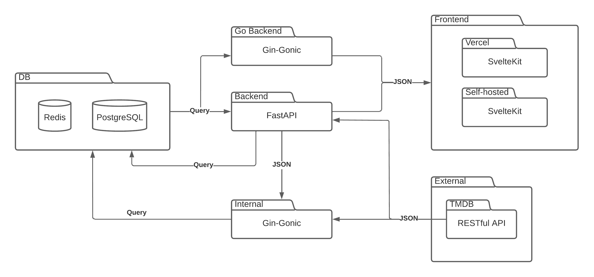

---

# Frontend

- Routes
- Components
- Styling(Tailwind/DaisyUI)
- Mobile first

---

# SvelteKit

Folder-based routing

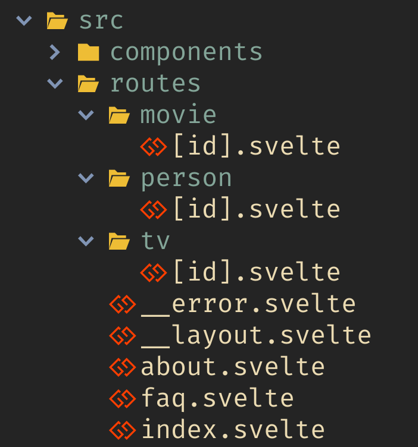

---

## Code-splitting

---

## Adapters

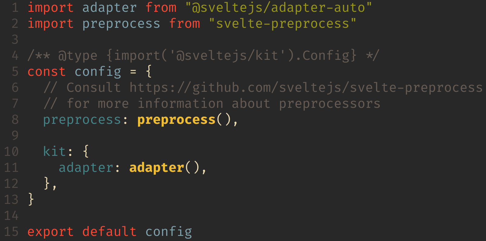

---

# Svelte

Declarative workflow

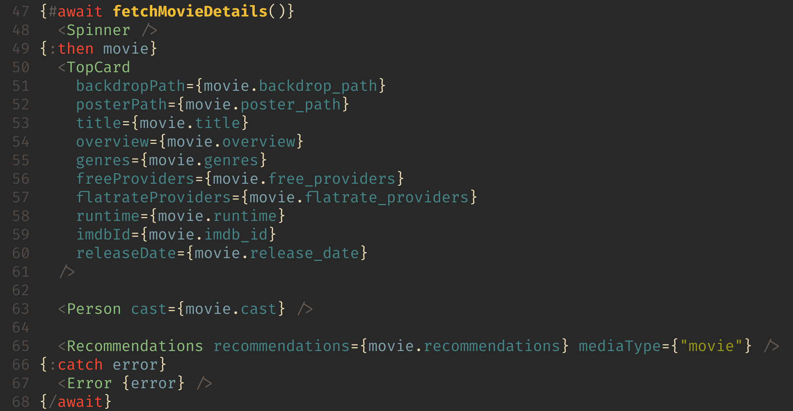

---

# Backend

- Typer
- FastAPI
- Gin-Gonic

---

# Optimization

- Fast prototyping with Python
- Move frequent TMDB calls into Redis
- Offload heavy jobs to Go

---

# FastAPI

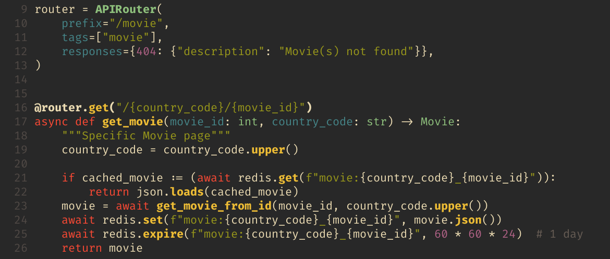

---

# Typer

Our projects CLI

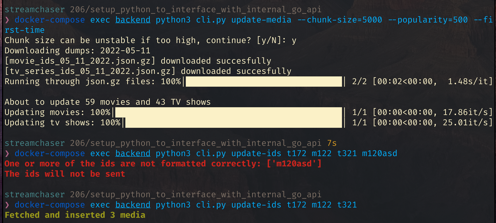

---

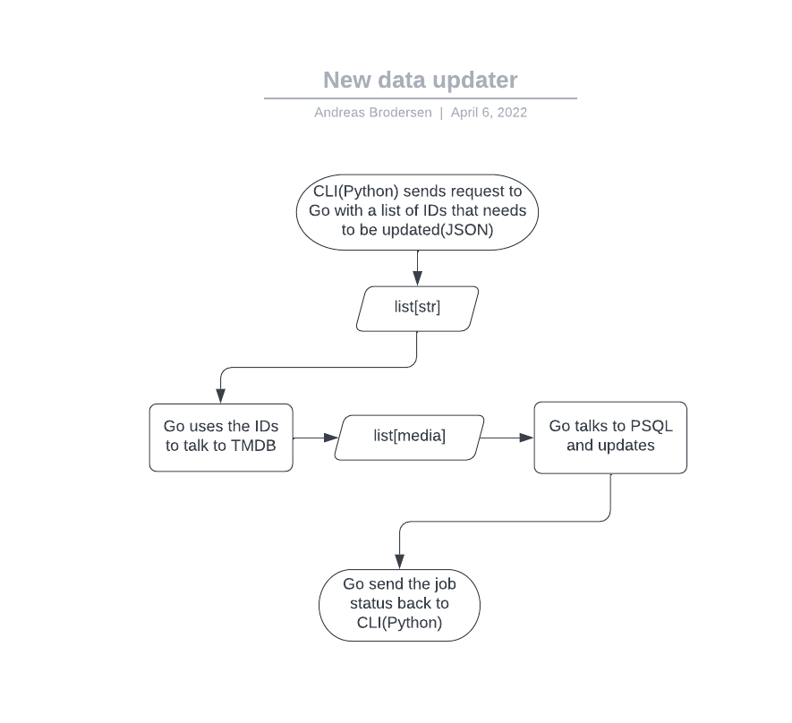

---

# Internal

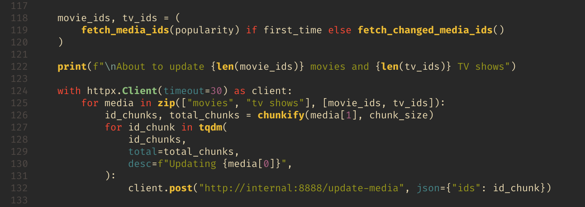

---

# CI/CD

- E2E - Playwright
- Pytest
- Pre-commit
- CodeFactor
- Vercel

---

---

# Vercel

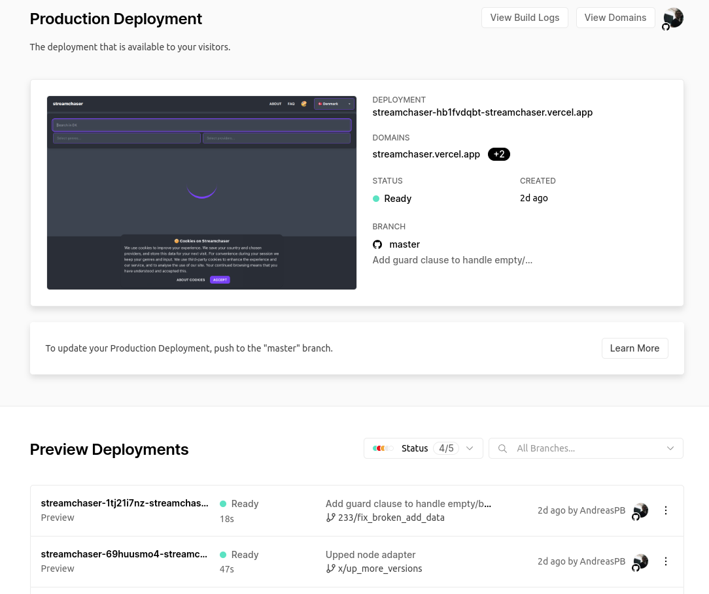

---

# Google Analytics

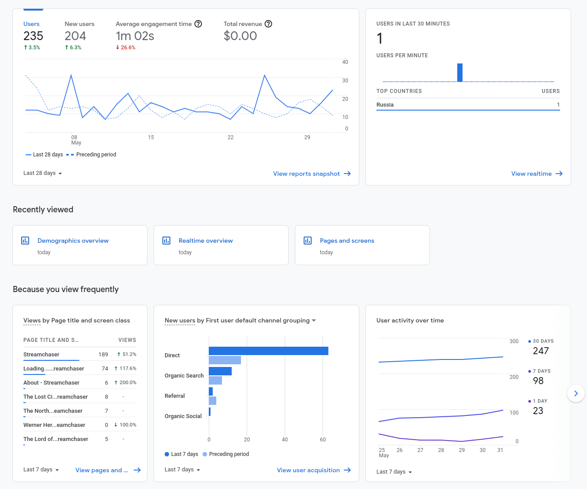

---

# Grafana

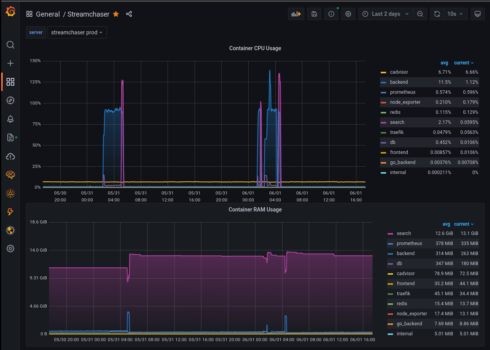

---
