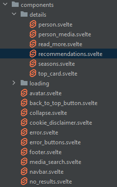
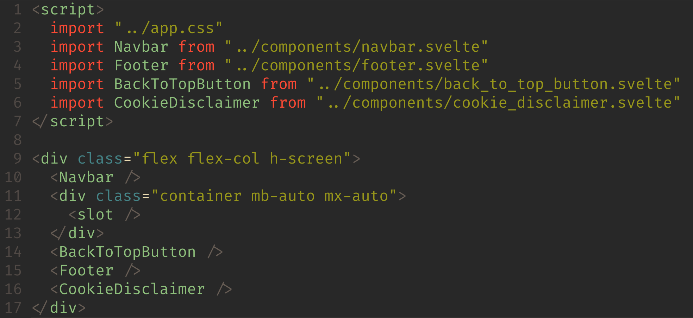

---

# Frameworks

Frontend:
- Svelte/Kit
- Tailwind
- DaisyUI

Backend:
- Gin-Gonic
- FastAPI

---

# Architecture

- Multitier Architecture
- Docker

---

# Frontend

- Svelte
- Routing
- Components
- Styling (Tailwind/DaisyUI)

---

# Svelte

- Javascript library/compiler

---

<video controls height=550px>
  <source src="static/sveltereactvue.mp4" type="video/mp4">
</video>

---

# Components

---

---

# Routing
- Filesystem-based routing through Sveltekit
- Dynamic parameters

    
    

---

# Styling
- Tailwindcss - CSS framework
  - Utility classes
  - Built-in media queries
  - Pseudo classes
  

- DaisyUI - Component framework

- Mobile-first approach

---

# CI/CD

- E2E
- Python test
- Pre-commit
- CodeFactor
- Vercel

---

---

# E2E

---

# Deployment

---

# Security

- CORS
- Authorization