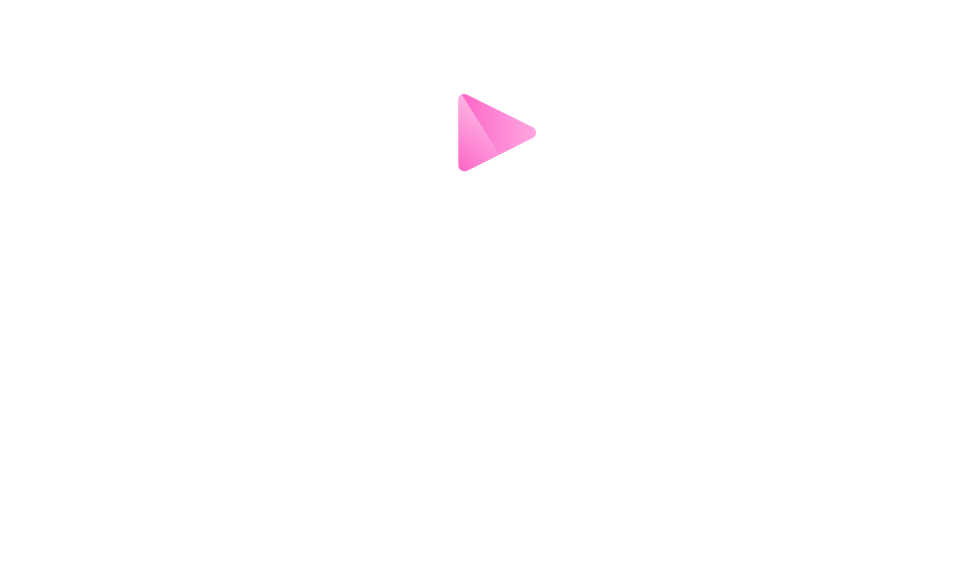
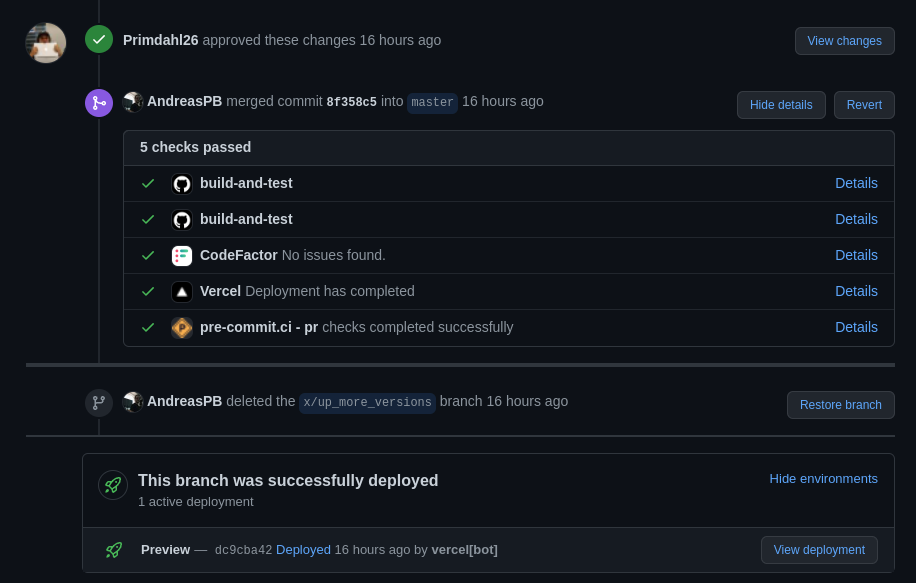

---

# Google Analytics

---

# Grafana

---

# Frameworks

Frontend:
- Svelte/Kit
- Tailwind
- DaisyUI

Backend:
- Go-Gonic
- FastAPI

---

# Frontend

- Routes
- Components
- Styling(Tailwind/DaisyUI)
- Mobile first

---

# Architecture

- Microservices
- Docker

---

# Backend

- FastAPI
- Go-Gonic

---

# Optimization

- Python -> Go
- Go concurrency model

---

Python:
- CLI
- Prototyping/MVPs

Go:
- Re-writes
- Offloading jobs from Python
- Talks with the client

---

# Media updater

---

# TMDB

---

# CI/CD

- E2E
- Python test
- Pre-commit

---

---

# Vercel/Serverless

- Adapters

---
